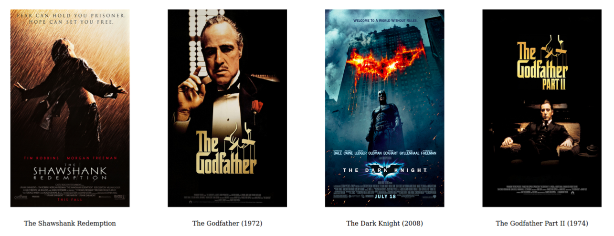

# Multimedia-Streamer

In this project, we plan to design a website for viewing movie information and trailers using DASH, similar to the IMDB website.

In the DASH protocol, we flexibly switch between different bit rates according to the network efficiency so that the video and audio streams do not stop.
